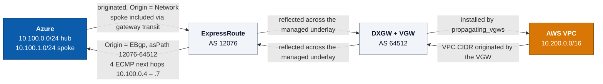

# azure-aws-interconnect-lab

Minimum-cost lab that proves private VM-to-VM connectivity between **Azure** and **AWS**
over an existing **AWS Interconnect – multicloud** link.

## End-to-end topology

```mermaid
flowchart LR
    classDef azure  fill:#0B5CAB,stroke:#08375F,color:#FFFFFF
    classDef aws    fill:#D97706,stroke:#7C4A02,color:#FFFFFF
    classDef fabric fill:#3F3F46,stroke:#18181B,color:#FFFFFF
    classDef net    fill:#EEF2F7,stroke:#64748B,color:#0F172A

    subgraph AZURE["Microsoft Azure · your subscription"]
        direction TB
        subgraph SPOKE["Spoke VNet · vnet-mcilab-spoke · 10.100.1.0/24 · East US 2"]
            AZVM["<b>vm-mcilab-azure</b><br/>Standard_B1s · Ubuntu 24.04<br/>10.100.1.4 · MTU 1400"]:::azure
            AZSEC["nsg-mcilab-vm<br/>SSH from operator /32<br/>any from 10.200.0.0/16"]:::net
        end
        subgraph HUB["Hub VNet · vnet-mcilab-hub · 10.100.0.0/24 · East US"]
            GWSUB["GatewaySubnet<br/>10.100.0.0/27"]:::net
            ERGW["<b>ergw-mcilab</b><br/>ExpressRoute gateway · Standard SKU<br/>BGP peers 10.100.0.4 – .7"]:::azure
        end
    end

    subgraph EDGE["Provider-managed interconnect"]
        direction TB
        CKT["<b>Multicloud Interconnect circuit</b><br/>tier MultiCloud · peering location useast<br/>existing, or built by azapi"]:::fabric
        UNDERLAY{{"Managed underlay<br/>4 x ECMP links · MACsec encrypted<br/>no VLAN · no BGP · no MD5 to configure"}}:::fabric
        ICX["<b>AWS Interconnect – multicloud</b><br/>mcc-…<br/>existing, or built by awscc"]:::fabric
    end

    subgraph AWSC["Amazon Web Services · your account · us-east-1"]
        direction TB
        DXGW["<b>Direct Connect gateway</b><br/>the interconnect attach point<br/>Amazon-side ASN 64512"]:::aws
        VGW["<b>Virtual private gateway</b><br/>free, vs. Transit Gateway at ~36 USD/mo"]:::aws
        subgraph VPC["VPC · 10.200.0.0/16"]
            RT["rt-mcilab-vm<br/>propagating_vgws enabled"]:::net
            AWSSEC["sg mcilab-vm<br/>SSH from operator /32<br/>any from 10.100.0.0/16"]:::net
            AWSVM["<b>vm-mcilab-aws</b><br/>t4g.nano · Amazon Linux 2023 arm64<br/>10.200.1.x · MTU 1400<br/>subnet 10.200.1.0/24"]:::aws
        end
    end

    AZVM --- AZSEC
    AZSEC ==>|"VNet peering<br/>allow_gateway_transit + use_remote_gateways"| GWSUB
    GWSUB --- ERGW
    ERGW ==>|"ExpressRoute connection<br/>conn-mcilab-to-aws"| CKT
    CKT <==> UNDERLAY
    UNDERLAY <==> ICX
    ICX ==>|"DXGW association<br/>state = associated"| DXGW
    DXGW <==> VGW
    VGW ==>|"route propagation"| RT
    RT --- AWSSEC
    AWSSEC --- AWSVM
```



The **Provider-managed interconnect** band is the transport, and you choose where it comes
from with [`interconnect_mode`](#where-the-interconnect-comes-from--interconnect_mode):
either you already own it (the default), or Terraform builds it. Either way, there is no
BGP session, VLAN, or MD5 key to configure anywhere on this path — the provider runs the
underlay and simply reflects prefixes between the two sides. Everything outside that band
is always built by this repo.

An editable version with the official Azure and AWS icon sets is in
[`docs/az-aws-interconnect.drawio`](docs/az-aws-interconnect.drawio) — open it at
[app.diagrams.net](https://app.diagrams.net) or with the draw.io VS Code extension.

### Why hub/spoke instead of one VNet

Two hard constraints collide:

1. `ER-AWS-Lab` is a **MultiCloud-tier** circuit, which the platform treats as a
   **Local** ExpressRoute circuit. A Local circuit attaches only to the one designated
   Azure region for its peering location — `useast` → **East US**. A gateway anywhere
   else is rejected:

   > `InvalidParameter: your circuit in useast cannot be connected to East US 2 on a
   > Local circuit. A Local ExpressRoute circuit can only connect to a designated Azure
   > region. Please upgrade the circuit to Standard SKU or Premium SKU.`

   MultiCloud tier has **no Standard/Premium upgrade path**, so the gateway must be in
   East US. (Verified the hard way: both `westus` and `eastus2` failed.)

2. **The lab subscription could not deploy VMs in East US** — every VM SKU reported
   `NotAvailableForSubscription` at `Location` scope. This is a per-subscription
   restriction, so yours may differ; check with
   `az vm list-skus -l eastus --size Standard_B1s --all -o table`.

Gateways are not VMs, so the gateway is happy in East US. Only the VM has to move. The
spoke reaches AWS through the hub's gateway via peering with `allow_gateway_transit` +
`use_remote_gateways`, and ExpressRoute advertises the spoke prefix to AWS automatically.

## The one thing to understand first

This is **not** a Megaport/Equinix cloud-router setup. It uses
[AWS Interconnect – multicloud](https://docs.aws.amazon.com/interconnect/latest/userguide/what-is-interconnect.html)
paired with
[Azure Multicloud Interconnect (Preview)](https://learn.microsoft.com/azure/multicloud-interconnect/overview).

- **There is no BGP session, VLAN, MD5 key, or 169.254.x.x peering to configure.**
  AWS and Microsoft own the underlay (MACsec-encrypted, 4-link ECMP). The
  activation-key exchange between the two clouds already happened.
- **On AWS the interconnect attach point is *always* a Direct Connect Gateway.**
  `aws interconnect list-connections` reports it as `attachPoint.directConnectGateway`.
- **On Azure the attach point is a normal ExpressRoute gateway + connection.**
- Azure MCI preview allows **exactly one gateway connection per interconnect**.

This repo **never creates or destroys** `ER-AWS-Lab` or `mcc-EXAMPLE01`. It only
attaches a VNet and a VPC to them.

## Naming

Every resource name derives from **`var.prefix`** (default `mcilab`):

| | Name |
|---|---|
| Resource group | `rg-mcilab-azure` |
| Azure VM | `vm-mcilab-azure` |
| AWS VM | `vm-mcilab-aws` |
| ER gateway | `ergw-mcilab` |
| ER connection | `conn-mcilab-to-aws` |
| Hub / spoke VNet | `vnet-mcilab-hub` / `vnet-mcilab-spoke` |
| AWS route table | `rt-mcilab-vm` |
| AWS VGW | `vgw-mcilab` |

`mci` is Microsoft's own abbreviation for Multicloud Interconnect, and `-lab` marks the
resources as disposable. The Azure VM is `-azure` rather than `-az` on purpose: `az` reads
as *availability zone* the moment you are looking at the AWS half of the diagram.

**The scripts do not hardcode any of these.** They read the
[`resource_names`](terraform/outputs.tf) output instead:

```powershell
terraform output -json resource_names
```

That indirection exists because an earlier rename silently broke verification — the scripts
kept querying names that no longer existed and cheerfully reported failures that were really
lookups against the wrong resource. Changing `var.prefix` now propagates everywhere by
itself.

> [!NOTE]
> `var.prefix` feeds the resource group name, so changing it on an existing deployment forces
> a destroy/recreate of everything — roughly 45 minutes, dominated by the ExpressRoute gateway
> (~25 min to build, ~9 min to delete, ~13 min for the connection). Fold a rename into a
> teardown/rebuild rather than paying that cost on its own.

## Where the interconnect comes from — `interconnect_mode`

There are **two layers** here, and they're easy to conflate:

| Layer | Resources | Controlled by |
|---|---|---|
| **The transport** — the Azure MCI circuit and its paired AWS Interconnect connection | `azapi_resource.mci`, `awscc_interconnect_connection.lab`, `aws_dx_gateway.lab` | `interconnect_mode` |
| **The attachment** — this lab hooking onto that transport | `azurerm_virtual_network_gateway_connection.ergw`, `aws_dx_gateway_association.lab` | `create_interconnect` |

### `interconnect_mode = "existing"` (default)

Bring your own. You already own a Multicloud Interconnect circuit and its AWS
counterpart; Terraform only attaches to them and **never creates or destroys
them**. Supply `express_route_circuit_id` and `dx_gateway_id` —
`scripts/00-configure` discovers both for you.

This is the default deliberately: it provisions nothing chargeable on the AWS side.

### `interconnect_mode = "create"`

Terraform builds the pair itself, Azure-first:

```
azapi_resource.mci                 Azure creates the MultiCloud circuit and
                                   mints an activationKey for it
        │
        │  activationKey  (a credential — see Security notes)
        ▼
awscc_interconnect_connection      AWS redeems the key, pairing the two clouds
        │
        │  attach_point
        ▼
aws_dx_gateway.lab                 where the interconnect lands in AWS
```

`terraform destroy` removes both sides again.

> [!WARNING]
> **`create` is not free.** Azure MCI carries no Azure service or egress charge
> during preview, but the **AWS Interconnect connection is billed per port-hour**
> at 1 Gbps. `scripts/00-configure` makes you confirm this explicitly before it
> will write `interconnect_mode = "create"`.

### Why two different providers are needed

Neither mainstream provider can do this on its own:

- **`azurerm` cannot create the Azure circuit.** Its `sku.tier` validator rejects
  the value outright, before any API call is made:
  ```
  Error: expected sku.0.tier to be one of ["Basic" "Local" "Premium" "Standard"], got MultiCloud
  ```
  So the circuit is created through **`azapi`**, which talks to the raw ARM
  surface where `MultiCloud_MeteredData` is perfectly valid.
- **`hashicorp/aws` has no resource for AWS Interconnect – multicloud.** It is
  exposed only through Cloud Control, so the AWS side uses **`awscc`**
  (`AWS::Interconnect::Connection`).

> [!IMPORTANT]
> `azure_mci_api_version` must stay at **`2025-09-01` or later**. On `2025-05-01`
> and earlier the circuit's `activationKey` property is *not returned at all* —
> not empty, not an error, simply absent. The AWS side would then be handed a
> null key and the pairing would fail with nothing obvious to point at.

## Existing resources this lab attaches to

In `interconnect_mode = "existing"`, these are yours to supply.
`scripts/00-configure` discovers every one of them and writes them to
`terraform.tfvars` (which is gitignored) — nothing below needs to be committed.

| Side | Object | Variable | Discovered by |
|---|---|---|---|
| Azure | Subscription | `azure_subscription_id` | `az account list` picker |
| Azure | MCI circuit (SKU `MultiCloud_MeteredData`) | `express_route_circuit_id` | filters `az network express-route list` to `sku.tier == MultiCloud` |
| Azure | Peering location → gateway region | `azure_hub_location` | read off the circuit; see [lesson 1](#1-a-multicloud-circuit-is-a-local-circuit--the-gateway-region-is-not-negotiable) |
| AWS | Account | `aws_account_id` | `aws sts get-caller-identity` |
| AWS | Interconnect | — | `aws interconnect list-connections` |
| AWS | Direct Connect Gateway (the interconnect's attach point) | `dx_gateway_id` | read from the interconnect's `attachPoint`, else a DXGW picker |

## Cost

| Item | ~USD/mo |
|---|---|
| **Azure ExpressRoute gateway (`Standard`)** | **~140** |
| Azure public IP (VM only — the ER gateway's is platform-managed and free) | ~4 |
| Azure VM `Standard_B1s` + 30 GB `Standard_LRS` | ~9 |
| AWS `t4g.nano` + 8 GB gp3 | ~4 |
| AWS public IPv4 | ~4 |
| AWS VGW / DXGW / DXGW association | **0** |
| Azure MCI circuit + egress | **0** (free during preview) |
| **Total** | **~161** |

~85% is the ExpressRoute gateway, and `Standard` is already the cheapest
ExpressRoute-capable SKU. **Run the teardown when you're done.**

Cost choices baked in:
- **VGW, not Transit Gateway** — DXGW→VGW association is free; a TGW attachment is ~$36/mo.
- `Standard_LRS` disk, smallest burstable VM sizes, nightly auto-shutdown on the Azure VM.
- Public IPs instead of Azure Bastion (~$140/mo) or AWS SSM VPC endpoints (~$21/mo).

## Prerequisites

| Tool | Install |
|---|---|
| Azure CLI | `winget install --id Microsoft.AzureCLI` |
| Terraform | `winget install --id Hashicorp.Terraform` |
| AWS CLI v2 | `winget install --id Amazon.AWSCLI` |

Permissions:
- **Azure** — Contributor on the subscription, plus at least Network Contributor on
  RG `ER-Circuits` to create the ExpressRoute connection. Same subscription, so no
  circuit authorization key is needed.
- **AWS** — `ec2:*`, `directconnect:Describe*`,
  `directconnect:CreateDirectConnectGatewayAssociation` /
  `DeleteDirectConnectGatewayAssociation`, and `interconnect:List*` for discovery.

## Runbook

```powershell
# 1. Configure everything interactively: validates tooling, signs in to both
#    clouds, picks the subscription and AWS profile, chooses interconnect_mode,
#    discovers the circuit + DXGW, and writes terraform.tfvars for you.
pwsh scripts/00-configure.ps1

#    Non-interactive equivalents:
#      pwsh scripts/00-configure.ps1 -InterconnectMode existing -NonInteractive
#      pwsh scripts/00-configure.ps1 -InterconnectMode create            # billed

# 2. Build (~20-30 min, dominated by the ExpressRoute gateway)
cd terraform
terraform init
terraform plan -out=tfplan
terraform apply tfplan

# 3. Validate the private path
cd ..
pwsh scripts/02-verify.ps1

# 4. Tear down (~10-20 min) - do not skip, the gateway is billed hourly
pwsh scripts/99-destroy.ps1
```

<details>
<summary>Manual path, if you'd rather not use <code>00-configure</code></summary>

```powershell
pwsh scripts/00-prereqs.ps1     # tooling + sign-in
pwsh scripts/aws-login.ps1      # first time only: configure the AWS profile
pwsh scripts/01-discover.ps1    # circuit + the interconnect's DXGW

cd terraform
cp terraform.tfvars.example terraform.tfvars   # then set the discovered ids
```
</details>

`terraform output next_steps` prints ready-to-paste SSH and test commands.

## What "working" looks like

1. `az network vnet-gateway list-learned-routes` on `ergw-mcilab` shows `10.200.0.0/16`.
2. The AWS route table `rt-mcilab-vm` shows the Azure **spoke** prefix `10.100.1.0/24`
   (and usually the hub's `10.100.0.0/24`) with origin `EnableVgwRoutePropagation`.
   ExpressRoute advertises the individual VNet prefixes, **not** the `10.100.0.0/16`
   supernet — the supernet only exists for the AWS security group rule.
3. The DXGW association state is `associated`.
4. Each VM pings the other's **private** IP.
5. `traceroute` shows no public hops.

`scripts/02-verify.ps1` checks all five.

## Reading the control plane

### How the two sides exchange prefixes



Both directions have to be independently true. The most common half-broken state is the
top row working and the bottom row missing, or vice versa — ping then fails in one
direction only, which is easy to misread as a firewall problem.

### Why dump the learned routes at all

A successful `terraform apply` proves the *resources* exist. It proves nothing about
whether traffic can actually flow. Between "connection created" and "VMs can talk" sit
several silent failure modes:

- The ExpressRoute connection can be `Connected` while BGP has learned **nothing**.
- The spoke VNet can be peered without `use_remote_gateways`, so its prefix is never
  advertised to AWS — the Azure VM is then unreachable even though the hub works.
- The VGW can be attached but route propagation disabled, so AWS has no return path.
  **Connectivity fails asymmetrically**, which looks identical to a firewall problem from
  inside the VM.

The learned-route tables are the only place these show up *before* you start debugging
`ping`. They also tell you the path is genuinely private — no public hop, no NAT.

### Dump both sides

```powershell
# Azure: what the ExpressRoute gateway has learned
az network vnet-gateway list-learned-routes `
  --name ergw-mcilab --resource-group rg-mcilab-azure --output table

# AWS: what the VPC route table has been given by the VGW
aws ec2 describe-route-tables `
  --filters "Name=tag:Name,Values=rt-mcilab-vm" `
  --profile mcilab --output table
```

`scripts/02-verify.ps1` runs both and asserts on them.

### Azure side — what a healthy result looks like

```
network       nextHop    origin  asPath       sourcePeer
-------       -------    ------  ------       ----------
10.100.0.0/24            Network              10.100.0.13
10.100.1.0/24            Network              10.100.0.13
10.200.0.0/16 10.100.0.5 EBgp    12076-64512  10.100.0.5
10.200.0.0/16 10.100.0.6 EBgp    12076-64512  10.100.0.6
10.200.0.0/16 10.100.0.4 EBgp    12076-64512  10.100.0.4
10.200.0.0/16 10.100.0.7 EBgp    12076-64512  10.100.0.7
```

How to read it:

| Field | Meaning | Why it matters |
|---|---|---|
| `origin = Network` | Locally originated Azure prefixes | **Both `10.100.0.0/24` (hub) and `10.100.1.0/24` (spoke) must appear.** If the spoke is missing, `use_remote_gateways` didn't take and AWS will never learn the VM's subnet. This is the single most important line to check in a hub/spoke build. |
| `origin = EBgp` | Learned from an external peer | Confirms real BGP with AWS, not a static route. |
| `asPath = 12076-64512` | `12076` = Microsoft's ExpressRoute ASN, `64512` = the Direct Connect Gateway's Amazon-side ASN | End-to-end proof the prefix came **from the AWS DXGW through the Microsoft underlay**. A two-hop AS path with exactly these two numbers is the signature of a healthy multicloud interconnect. |
| 4 rows for `10.200.0.0/16` | Four next-hops: `10.100.0.4` – `.7` | The interconnect's **4-link ECMP** underlay, one BGP session per link. Seeing fewer than four means links are down — traffic still flows, but you've lost redundancy and throughput headroom. |
| `nextHop` inside `10.100.0.0/27` | The GatewaySubnet | The path stays on private addressing — no public hop. |

Note the ASNs are *not* something this repo configures. `64512` was read from the
existing DXGW during discovery; `12076` is Microsoft's. There is no BGP session to set up
on either side — see [The one thing to understand first](#the-one-thing-to-understand-first).

### AWS side — what a healthy result looks like

```
DestinationCidrBlock GatewayId             Origin                    State
-------------------- ---------             ------                    -----
10.200.0.0/16        local                 CreateRouteTable          active
0.0.0.0/0            igw-08b80331906ff1662 CreateRoute               active
10.100.0.0/24        vgw-0abc123def4567890 EnableVgwRoutePropagation active
10.100.1.0/24        vgw-0abc123def4567890 EnableVgwRoutePropagation active
```

- `Origin = EnableVgwRoutePropagation` is the proof the prefixes arrived **via BGP**, not
  as hand-written static routes. If you see `CreateRoute` for an Azure prefix, someone
  added a static route and the test is invalid.
- **Both Azure /24s must be present**, and `10.100.1.0/24` specifically — that's the
  subnet the Azure VM lives in. `02-verify.ps1` asserts on the spoke prefix for exactly
  this reason.
- ExpressRoute advertises the **individual VNet prefixes**, never the `10.100.0.0/16`
  supernet. The supernet exists only to keep the AWS security group rule simple.

### Also worth checking

```powershell
aws directconnect describe-direct-connect-gateway-associations `
  --direct-connect-gateway-id 11111111-2222-3333-4444-555555555555 `
  --profile mcilab --output table
```

State must be `associated` (not `associating`), and `allowedPrefixes` must list the AWS
VPC CIDR. A stuck `associating` is the usual reason Azure sees no AWS prefix.

## Lessons learned


Everything below was learned by hitting it. Ordered by how much time it cost.

### 1. A `MultiCloud` circuit is a **Local** circuit — the gateway region is not negotiable

This was the single biggest time sink: **three gateway builds, ~75 minutes of pure
provisioning**, before the real constraint surfaced.

`ER-AWS-Lab` reports `sku.tier = MultiCloud`. Nothing in the circuit's properties says
"Local". But the control plane evaluates it as a Local circuit, and a Local circuit
attaches only to the **one designated Azure region** for its peering location
(`useast` → **East US**). The truth only appears when the *connection* is created:

```
Status: "InvalidParameter"
Message: "The creation of the virtual network gateway connection failed because your
circuit in useast cannot be connected to East US 2 on a Local circuit. A Local
ExpressRoute circuit can only connect to a designated Azure region. Please upgrade the
circuit to Standard SKU or Premium SKU."
```

Three traps stacked here:

- **The gateway succeeds in the wrong region.** `westus` and `eastus2` both built a
  perfectly healthy ExpressRoute gateway in ~25 min, *then* failed at the connection.
  You pay the full gateway build time before learning anything.
- **The suggested fix is a dead end.** There is no Standard/Premium variant of the
  MultiCloud tier, so "upgrade the circuit" is not actionable.
- **The docs point the wrong way.** The
  [MCI limits page](https://learn.microsoft.com/azure/multicloud-interconnect/availability-limits)
  lists Australia East / East US / Germany West Central / West US as supported regions,
  which reads as "any of these four works". For a *given* circuit, only the region
  matching its peering location works.

> **Rule of thumb:** for a Multicloud Interconnect circuit, put the ExpressRoute gateway
> in the Azure region that matches the circuit's `serviceProviderProperties.peeringLocation`.
> Don't infer it from the supported-regions list.

### 2. Region restrictions can be subscription-wide, not just zonal

`Standard_B1s` failed in `eastus` with `SkuNotAvailable`. Checking further showed **all
1420 VM sizes** in `eastus` were blocked for this subscription — at `type: Location`, not
`type: Zone`:

```powershell
az vm list-skus -l eastus --resource-type virtualMachines `
  --query "[?name=='Standard_B1s'].restrictions"
```

`type: Zone` restrictions are routine and harmless for a non-zonal VM. `type: Location`
means the subscription genuinely cannot deploy there — no quota request fixes it quickly.
**Always check which type you're looking at.**

### 3. The two constraints collide — hence hub/spoke

Gateway *must* be in East US (lesson 1). VMs *cannot* be in East US (lesson 2).

The resolution: **gateways are not virtual machines**, so the VM SKU restriction doesn't
apply to them. Put the ExpressRoute gateway in an East US hub VNet with nothing else in
it, put the VM in an East US 2 spoke, and peer them with `allow_gateway_transit` +
`use_remote_gateways`. ExpressRoute then advertises the spoke prefix to AWS
automatically. Cost delta is cross-region peering data transfer — pennies for a lab.

This is worth remembering generally: **a workload region and a connectivity region do not
have to be the same region.**

### 4. Terraform state and Azure can desynchronise badly after a failed apply

Several distinct failures, all from the same root cause — a partially-applied change:

- **Deleting and recreating a resource group in one apply races itself.** The RG delete
  returned "complete", Terraform immediately recreated it, and Azure's backend was still
  tearing down the old RG — which deleted the newly created children. The tell was an RG
  create taking 43s instead of ~2s. Newly created public IPs vanished with
  `Provider produced inconsistent result after apply ... Root object was present, but now absent`.
- **Subnet IDs are region-independent**, so when the VNet moved regions Terraform saw *no
  diff* on `azurerm_subnet` and never recreated the subnets. The VNet came up with zero
  subnets and the gateway failed with `InvalidResourceReference`.
- **The VNet silently dropped out of state** across failed applies, so the next apply
  tried to create it and hit `already exists ... needs to be imported`.

What actually worked:

```powershell
terraform apply -refresh-only -auto-approve   # resync state with reality
terraform import <addr> <resource-id>         # re-adopt orphans
terraform plan -out=tfplan                    # save the plan
terraform apply tfplan                        # apply the SAVED plan
```

**Apply a saved plan file after a failed run.** `terraform apply -auto-approve` re-plans
from scratch, and if state drifted it will happily try to recreate things that exist.
When a region changes, deleting the RG out-of-band and waiting for it to be *fully* gone
(`az group exists` → `false`) is more reliable than letting one apply delete and recreate it.

### 5. Azure injects `ip_tags` that force an infinite replacement loop

This subscription stamps `ip_tags = { FirstPartyUsage = "/Unprivileged" }` onto public
IPs. Terraform reads it as drift, tries to remove it, and `ip_tags` forces replacement —
so **every** plan wants to replace the public IP. The destroy then fails anyway:

```
PublicIPAddressCannotBeDeleted: ... still allocated to resource .../nic-mcilab-vm
```

Fix:

```hcl
lifecycle {
  ignore_changes = [ip_tags]
}
```

### 6. A failed ExpressRoute connection leaves an orphan that blocks gateway deletion

The failed `conn-mcilab-to-aws` was never written to Terraform state, but it *did* exist
in Azure. Deleting the gateway then failed with `VirtualNetworkGatewayCannotBeDeleted`.
Remove the orphan first:

```powershell
az network vpn-connection delete -g rg-mcilab-azure -n conn-mcilab-to-aws
```

Note the command is `vpn-connection` even for an ExpressRoute connection.

### 7. VNet flow logs need storage **shared keys** — which policy often forbids

The apply that built this lab succeeded on every resource on the critical path and failed
on exactly one: `azurerm_storage_account.flowlogs`.

```
403 Key based authentication is not permitted on this storage account.
KeyBasedAuthenticationNotPermitted
```

The subscription carries an Azure Policy that sets `allowSharedKeyAccess = false` on
storage accounts. That is a good default — but **VNet flow logs write to the storage
account with the account key**, and there is no Entra-ID-only alternative for the flow
log writer. Microsoft-managed identity is not an option for this data path. So on a
subscription with that policy, flow logs simply cannot be enabled to storage.

Two things made this worse than it had to be:

- **The failure is sticky.** The account is created before the provider tries to read
  its queue properties, so the resource lands in state in a state Terraform then cannot
  *refresh* — every later `plan` fails with the same 403 before it can produce a plan.
  Recovering means `terraform state rm 'azurerm_storage_account.flowlogs[0]'` followed by
  `az storage account delete`, not just flipping a variable.
- **It took the wrong things down with it.** Flow logs were originally gated on the same
  `enable_observability` switch as Log Analytics and Connection Monitor, so one blocked
  resource poisoned the whole observability stack.

The fix is a **separate switch**, defaulted off:

```hcl
enable_observability = true   # Log Analytics + Connection Monitor  (works everywhere)
enable_flow_logs     = false  # VNet flow logs -> storage           (needs shared keys)
```

Connection Monitor is the better signal for this lab anyway: it measures the actual
cross-cloud path continuously, whereas flow logs only record that packets happened.

> **Check before you enable it:**
> `az policy assignment list --query "[?contains(displayName,'shared key')]"`, or simply
> try `az storage account create ... --allow-shared-key-access true` and see if it is denied.

### 8. Small things that still cost real time

| Trap | Reality |
|---|---|
| `aws ... -o json` | **AWS CLI needs `--output json`.** `-o` is Azure-CLI-only and fails with `Unknown options: -o, json`. Cost the most debugging per character of any item here. |
| `aws interconnect list-connections` field names | Returns `id`, not `name` or `connectionId`. The attach point is `attachPoint.directConnectGateway`. |
| `terraform destroy -target=azurerm_x.y` in PowerShell | PowerShell mangles it into `-target=azurerm_x`. Quote the whole argument: `'-target=azurerm_x.y'`. |
| ER gateway `public_ip_address_id` | Rejected by azurerm 4.x — ExpressRoute gateways get a platform-managed public IP. Also saves ~$4/mo. |
| `aws_vpn_gateway_route_propagation` | Races VGW attachment and fails with `couldn't find resource`. Use `propagating_vgws = [...]` inline on `aws_route_table` instead. |
| AWS security group naming | `name` cannot begin with `sg-`. The `Name` *tag* can. |
| MTU | ExpressRoute caps TCP/UDP payload at 1400 bytes and does not fragment. Clamp both VMs to MTU 1400 and probe with `ping -M do -s 1372` (pass) / `-s 1373` (fail). |
| `GatewaySubnet` | Never attach an NSG or a `0.0.0.0/0` UDR to it. |
| Gateway timing | ~25 min to create, ~9 min to delete. Set `timeouts` generously and expect to wait. |

### 9. What was right from the start

Worth recording so it isn't re-litigated:

- **No BGP, VLAN, MD5, or 169.254.x.x peering anywhere.** The managed interconnect owns
  the underlay. Every instinct from a Megaport/Equinix ExpressRoute build is wrong here.
- **The AWS attach point is always a Direct Connect Gateway**, already created and bound
  to the interconnect. Reuse it; never try to create it.
- **VGW over Transit Gateway** — DXGW→VGW association is free, a TGW attachment is ~$36/mo.
- **Discovery before Terraform.** `01-discover.ps1` supplied the DXGW id, the circuit id
  and the "zero existing gateway connections" check that the preview limit requires.

## Gotchas quick reference

- **MTU 1400** on both VMs; `lab-mtu.service` handles it.
- **Never** put an NSG or `0.0.0.0/0` UDR on `GatewaySubnet`.
- **The AWS prefix is learned, not static** — `propagating_vgws` on the VPC route table.
- **The gateway must be in `eastus`; the VM must not be.** See
  [Why hub/spoke](#why-hubspoke-instead-of-one-vnet).
- **Your public IP is auto-detected** via `ifconfig.me` and pinned into the NSG and
  security group. If it changes, re-run `terraform apply` or set `my_public_ip`.
- **AWS CLI uses `--output json`, not `-o json`.**
- **The ExpressRoute gateway takes ~25 min to create.** Timeouts are set to 90m.
- **`enable_flow_logs` defaults to `false`** — flow logs require storage shared-key
  access, which many subscriptions deny by policy. Log Analytics and Connection Monitor
  are on a separate switch (`enable_observability`) and are unaffected.

## Security notes

- `terraform.tfvars`, `*.tfstate*`, and `ssh/` are gitignored.
- The lab SSH key is generated by Terraform and therefore **stored in state**.
  Acceptable for a throwaway lab with a local backend; do not copy this pattern.
- **The interconnect activation key is a credential.** In
  `interconnect_mode = "create"`, Azure mints an `activationKey` on the circuit;
  redeeming it is what authorises pairing that circuit to an AWS account. It is
  therefore:
  - a `sensitive = true` output (`interconnect_activation_key`), so it is never
    printed by `terraform apply` or by the helper scripts;
  - present in `terraform.tfstate` like any other sensitive value, which is one
    more reason state is gitignored;
  - not to be pasted into chats, issues, or commit messages. Treat a leaked key
    like a leaked token: destroy the circuit and create a new one.
- The IAM user `<your-lab-iam-user>` has `AdministratorAccess`. Delete its access key and the
  user itself when the lab is finished:
  ```powershell
  aws iam list-access-keys --user-name <your-lab-iam-user> --profile mcilab
  aws iam delete-access-key --user-name <your-lab-iam-user> --access-key-id <AKIA...> --profile mcilab
  ```

