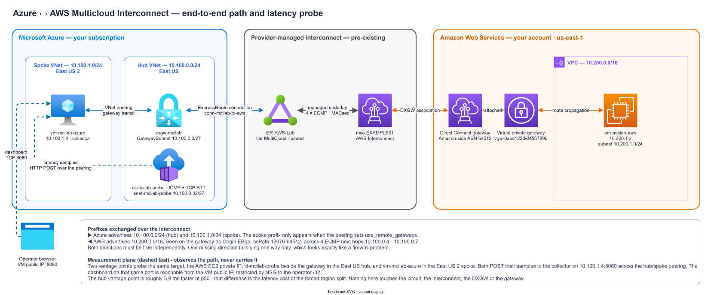
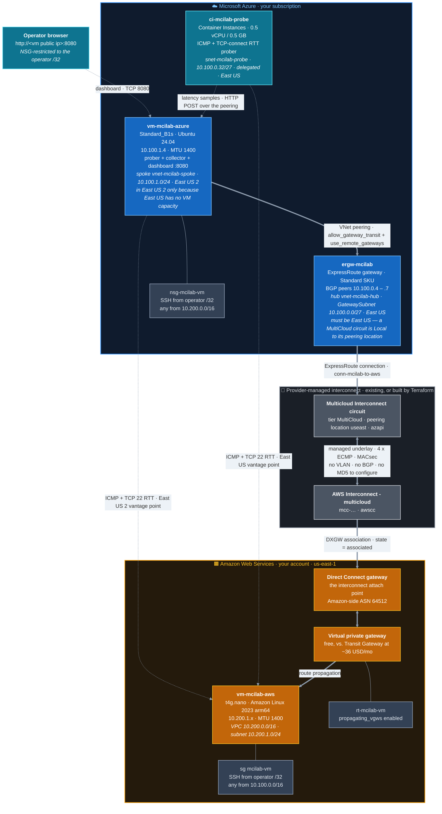
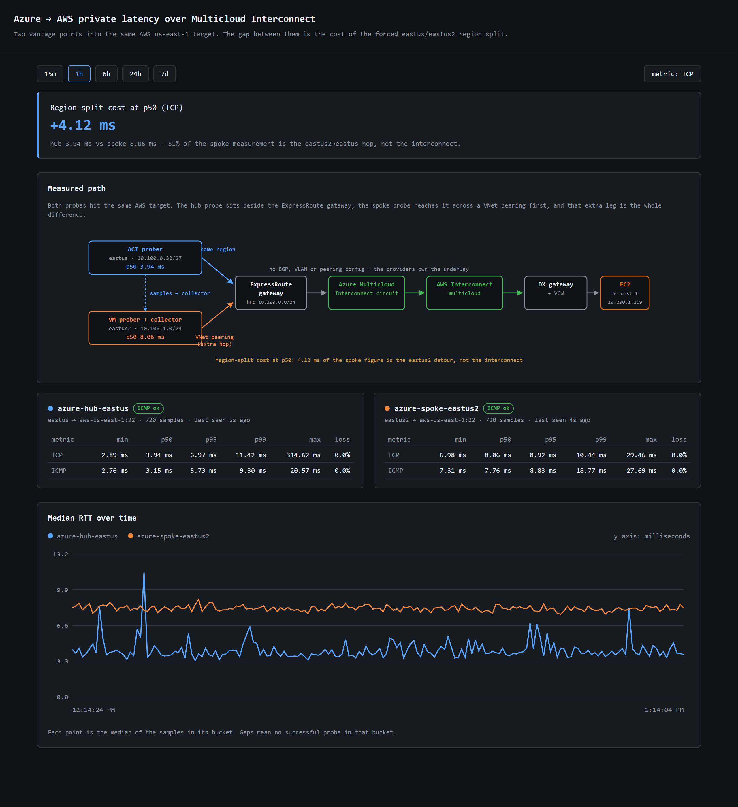

<h1 align="center">Azure ⇄ AWS Multicloud Interconnect Lab</h1>

<p align="center">
  Private, minimum-cost VM-to-VM connectivity between <b>Azure</b> and <b>AWS</b><br/>
  over an <b>AWS Interconnect – multicloud</b> link paired with an
  <b>Azure Multicloud Interconnect</b> circuit.
</p>

<p align="center">
  
  
  
  
  
</p>

---

Two Linux VMs — one in each cloud — talk to each other over **private addresses only**,
with no VPN, no public hops, and no BGP to configure. Terraform builds both landing zones
and attaches them to the provider-managed interconnect; four commands take you from an
empty subscription to a verified end-to-end path.

| I want to… | Go to |
|---|---|
| Understand what the path looks like | [Architecture](#architecture) |
| **Check I have everything I need** | **[Prerequisites checklist](#prerequisites-checklist)** |
| Know what it costs | [Cost](#cost) |
| **Bring the lab up** | **[Deploy](#deploy)** |
| Prove it actually works | [Verify](#verify) |
| **Measure what the path costs in milliseconds** | **[Latency probe](#latency-probe)** |
| Change region, prefix, or CIDRs | [Configuration](#configuration) |
| Read the routing in detail | [docs/control-plane.md](docs/control-plane.md) |
| See what went wrong along the way | [docs/lessons-learned.md](docs/lessons-learned.md) |

---

## Architecture

### End-to-end topology

<p align="center">
  <picture>
    <source media="(prefers-color-scheme: dark)" srcset="docs/az-aws-interconnect-dark.svg">
    <source media="(prefers-color-scheme: light)" srcset="docs/az-aws-interconnect.svg">
    
  </picture>
</p>

<p align="center">
  <a href="https://app.diagrams.net/?url=https%3A%2F%2Fraw.githubusercontent.com%2Fdmauser%2Fazure-aws-interconnect-lab%2Fmain%2Fdocs%2Faz-aws-interconnect.drawio">
    
  </a>
</p>

> [!NOTE]
> **Why the VM is in East US 2 while the gateway is in East US.** This is not a design
> choice — it is two constraints colliding. A `MultiCloud` circuit is evaluated as a *Local*
> circuit, so its gateway can only attach to the region matching the circuit's peering
> location (`useast` → East US). But this subscription has **no VM capacity in East US at
> all**: all ~1420 SKUs report a restriction of `type: Location`, which is capacity, not
> quota, so a quota request will not clear it. Gateways are not VMs, so only the VM had to
> move. Hence the hub/spoke split, and hence the [latency probe](#latency-probe) — it exists
> to measure how much of the end-to-end latency is this forced extra hop rather than the
> interconnect. Full detail in [Why hub/spoke instead of one VNet](#why-hubspoke-instead-of-one-vnet).

<details>
<summary><b>Same topology as a Mermaid diagram</b> — renders inline, easier to diff in pull requests</summary>



The dotted teal edges are the **measurement plane**. They observe the path; they never
carry it. Nothing about the circuit, the interconnect, the DXGW, the VGW or the gateway
changes when the probe is enabled.

</details>

### The one thing to understand first

This is **not** a Megaport/Equinix cloud-router setup. It uses
[AWS Interconnect – multicloud](https://docs.aws.amazon.com/interconnect/latest/userguide/what-is-interconnect.html)
paired with
[Azure Multicloud Interconnect (Preview)](https://learn.microsoft.com/azure/multicloud-interconnect/overview),
and the two cloud providers own everything in between.

> [!IMPORTANT]
> **There is no BGP session, VLAN, MD5 key, or 169.254.x.x peering to configure anywhere
> in this lab.** Every instinct carried over from a traditional ExpressRoute or Direct
> Connect build is wrong here.

| | |
|---|---|
| **The underlay** | Owned by AWS and Microsoft — MACsec-encrypted, 4-link ECMP. The activation-key exchange between the clouds has already happened. |
| **AWS attach point** | *Always* a Direct Connect Gateway. `aws interconnect list-connections` reports it as `attachPoint.directConnectGateway`. |
| **Azure attach point** | A normal ExpressRoute gateway + connection. |
| **Preview limit** | Exactly **one** gateway connection per interconnect. |

### Why hub/spoke instead of one VNet

Two hard constraints collide, and the hub/spoke shape is the only thing that satisfies
both:

<table>
<tr><th width="50%">1 · The gateway must be in East US</th><th width="50%">2 · The VM could not be in East US</th></tr>
<tr valign="top"><td>

A **MultiCloud-tier** circuit is treated as a **Local** ExpressRoute circuit, and a Local
circuit attaches only to the one Azure region designated for its peering location
(`useast` → **East US**). Anything else is rejected:

> `InvalidParameter: your circuit in useast cannot be connected to East US 2 on a Local
> circuit. […] Please upgrade the circuit to Standard SKU or Premium SKU.`

MultiCloud tier has **no Standard/Premium upgrade path**, so that advice is a dead end.

</td><td>

East US had **no VM capacity** for this subscription — all 1420 sizes were restricted at
`type: Location`, so the VM had to land in **East US 2**.

This one is subscription- and time-specific. Check yours:

```powershell
az vm list-skus -l eastus --size Standard_B1s --all -o table
```

If East US works for you, set `azure_location = "eastus"` and the two VNets collapse into
one.

</td></tr>
</table>

**Gateways are not virtual machines**, so the gateway is perfectly happy in East US — only
the VM has to move. The spoke reaches AWS through the hub's gateway via peering with
`allow_gateway_transit` + `use_remote_gateways`, and ExpressRoute advertises the spoke
prefix to AWS automatically.

<sub>Full detail in [lessons 1–3](docs/lessons-learned.md).</sub>

### What this repo builds

```
                    built by this repo          never touched by this repo
  Azure   ─────────────────────────────────    ──────────────────────────────
          hub VNet + GatewaySubnet                 the MCI circuit *
          ExpressRoute gateway (Standard)
          ExpressRoute connection
          spoke VNet + peering (both ways)
          NSG, public IP, Ubuntu VM

  AWS     VPC, subnet, IGW, route table           the AWS Interconnect *
          Virtual Private Gateway                 the Direct Connect Gateway *
          DXGW association
          security group, EIP, AL2023 VM

  * unless interconnect_mode = "create" — see Configuration
```

```
.
├── terraform/            one root module; Azure and AWS split into separate files
│   ├── interconnect.tf   only used when interconnect_mode = "create"
│   ├── observability.tf  Log Analytics + Connection Monitor (optional)
│   └── cloudinit/        MTU 1400 clamp on both VMs
├── scripts/              00-configure · 00-prereqs · 01-discover · 02-verify · 04-routes
│                         05-latency · 99-destroy
│                         (.ps1 everywhere, .sh twins for configure/verify/routes/latency/destroy)
└── docs/                 control-plane.md · lessons-learned.md · sample-routes.txt · editable .drawio
```

Every script is PowerShell-first; five of them ship a bash twin that takes the same flags.
There is no `03-` — the numbering gap is deliberate.

| Script | PowerShell | bash | What it does |
|---|---|---|---|
| `00-prereqs` | `pwsh scripts/00-prereqs.ps1` | — | Tooling and sign-in check for both clouds. |
| `aws-login` | `pwsh scripts/aws-login.ps1` | — | Stores the `mcilab` AWS profile; never echoes the secret. |
| `00-configure` | `pwsh scripts/00-configure.ps1` | `./scripts/00-configure.sh` | Interactive setup end to end; writes `terraform.tfvars`. |
| `01-discover` | `pwsh scripts/01-discover.ps1` | — | Authoritative dump of circuit + interconnect + DXGW state. |
| `02-verify` | `pwsh scripts/02-verify.ps1` | `./scripts/02-verify.sh` | Post-deploy: routes, propagation, DXGW state, ping, MTU. |
| `04-routes` | `pwsh scripts/04-routes.ps1` | `./scripts/04-routes.sh` | Read-only routing dump on both ends. |
| **`05-latency`** | **`pwsh scripts/05-latency.ps1`** | **`./scripts/05-latency.sh`** | **Reads the collector and prints the two vantage points' min/p50/p95. See [Latency probe](#latency-probe).** |
| `99-destroy` | `pwsh scripts/99-destroy.ps1` | `./scripts/99-destroy.sh` | Teardown, plus a check that the ER gateway is really gone. |
| `render-diagrams` | `pwsh scripts/render-diagrams.ps1` | — | Docs tooling, not part of the lab lifecycle. Rebuilds both SVGs from the drawio source. |

> [!TIP]
> **Editing the diagram?** Change `docs/az-aws-interconnect.drawio`, then run
> `pwsh scripts/render-diagrams.ps1` — never hand-edit the SVGs. A bare
> `draw.io --export` is not enough: five Azure icons live inside draw.io's own `app.asar`
> and come out as `file:///C:/Users/<you>/...` references that render broken for everyone
> else, `--embed-images` does not fix it, and there is no `--background` flag. The script
> handles all three, and pins draw.io's random per-export id salt so the diff stays
> readable. It fails loudly rather than writing a broken diagram. Keep the Mermaid block
> above in sync by hand, and recapture `docs/latency-dashboard.png` if the dashboard UI
> changed.

---

## Before you start

> [!IMPORTANT]
> **The lab will not run without all five items below.** `scripts/00-configure` checks
> every one of them and stops with a specific message if something is missing — run it
> first and let it tell you, rather than finding out 25 minutes into a gateway build.

### Prerequisites checklist

| ✔ | You need | How to get it / check it |
|---|---|---|
| 1 | **An Azure subscription** — and its subscription ID | `az login` then `az account show --query id -o tsv` |
| 2 | **An AWS account** — and its 12-digit account ID | `aws sts get-caller-identity --query Account --output text` |
| 3 | **An Azure Multicloud Interconnect circuit** (SKU `MultiCloud_MeteredData`), with **zero** gateway connections already on it | `az network express-route list --query "[?sku.tier=='MultiCloud'].{name:name,rg:resourceGroup,peering:serviceProviderProperties.peeringLocation}" -o table` |
| 4 | **An AWS Interconnect – multicloud** connection, already paired with that circuit, plus the **Direct Connect Gateway** it attaches to | `aws interconnect list-connections --output json` → note `attachPoint.directConnectGateway` |
| 5 | **Permissions in both clouds** | see [Permissions](#permissions) below |

> [!NOTE]
> **Items 3 and 4 already exist?** That is the default — `interconnect_mode = "existing"`,
> and `scripts/00-configure` discovers both IDs for you, so you never type them by hand.
>
> **Don't have them yet?** Terraform can build both, Azure-first, with
> `interconnect_mode = "create"`. Then you only need items 1, 2 and 5 — but read the
> [billing warning](#where-the-interconnect-comes-from) first, because the AWS side is
> charged per port-hour.

Two more things, both handled for you:

- **SSH key** — generated lab-scoped into `ssh/` by Terraform. Set `ssh_public_key` to
  reuse your own instead.
- **Your public IP** — auto-detected via `ifconfig.me` and pinned as a `/32` into both the
  NSG and the AWS security group. Override with `my_public_ip` if detection is wrong (VPN,
  CGNAT, split tunnel).

> [!WARNING]
> **Azure MCI is in preview and allows exactly one gateway connection per interconnect.**
> If your circuit already has a connection, this lab cannot attach to it — delete the
> existing connection first, or use a different circuit. `scripts/01-discover.ps1` checks
> this explicitly.

### Tooling

| Tool | Install (Windows) | Install (macOS/Linux) |
|---|---|---|
| Azure CLI | `winget install Microsoft.AzureCLI` | `brew install azure-cli` |
| Terraform ≥ 1.5 | `winget install Hashicorp.Terraform` | `brew install terraform` |
| AWS CLI v2 | `winget install Amazon.AWSCLI` | `brew install awscli` |
| `jq` (bash scripts only) | — | `brew install jq` |

Run `pwsh scripts/00-prereqs.ps1` to verify all three are installed, on `PATH`, and
signed in.

### Permissions

| Cloud | Needs |
|---|---|
| **Azure** | Contributor on the subscription, plus at least Network Contributor on the resource group holding the circuit. Same subscription, so no circuit authorization key is required. |
| **AWS** | `ec2:*`, `directconnect:Describe*`, `directconnect:*DirectConnectGatewayAssociation`, and `interconnect:List*` for discovery. |

<details>
<summary>Signing in to AWS</summary>

The scripts default to an AWS CLI profile named `mcilab`. Create it with either:

```powershell
pwsh scripts/aws-login.ps1          # prompts for an access key, never echoes the secret
aws configure sso --profile mcilab  # or use SSO if your org requires it
```

Then pass `-AwsProfile <name>` / set `aws_profile` if you used a different name.

</details>

### Cost

| Item | ~USD/mo |
|---|---|
| **Azure ExpressRoute gateway (`Standard`)** | **~140** |
| Azure public IP (VM only — the gateway's is platform-managed and free) | ~4 |
| Azure VM `Standard_B1s` + 30 GB `Standard_LRS` | ~9 |
| AWS `t4g.nano` + 8 GB gp3 | ~4 |
| AWS public IPv4 | ~4 |
| AWS VGW / DXGW / DXGW association | **0** |
| Azure MCI circuit + egress | **0** (free during preview) |
| Azure Container Instances `ci-mcilab-probe` — 0.5 vCPU / 0.5 GB, **always-on** | ~16 |
| **Total** | **~177** |

> [!WARNING]
> **~85% of the cost is the ExpressRoute gateway**, and `Standard` is already the cheapest
> ExpressRoute-capable SKU — there is no cheaper option. It bills hourly from the moment it
> exists. **Run [the teardown](#step-4--tear-down) when you are done.**

> [!IMPORTANT]
> **The [latency probe](#latency-probe) container group is a real recurring cost.** Azure
> Container Instances bills **per vCPU-second and per GB-second** for the lifetime of the
> container group — metered from the first image pull until the group terminates, with
> deployment time excluded. The probe is sized **0.5 vCPU / 0.5 GB** and runs continuously,
> so the charge scales with uptime rather than with traffic.
>
> At East US Consumption rates of **$0.0405 per vCPU-hour** and **$0.00445 per GB-hour**,
> 730 hours comes to **~$16.41/mo** (`0.5 × 730 × 0.0405` + `0.5 × 730 × 0.00445`). Rates
> fetched from the [Azure Retail Prices API](https://learn.microsoft.com/rest/api/cost-management/retail-prices/azure-retail-prices)
> on 2026-09-18 with:
>
> ```
> https://prices.azure.com/api/retail/prices?$filter=serviceName eq 'Container Instances'
>   and armRegionName eq 'eastus' and priceType eq 'Consumption'
> ```
>
> Rates are region-specific and change — re-run that query for your own region rather than
> trusting this number, and set `enable_latency_probe = false` if you do not want the
> charge. Destroy the group with the rest of the lab either way.

<details>
<summary>Cost choices baked into the design</summary>

- **VGW, not Transit Gateway** — a DXGW→VGW association is free; a TGW attachment is
  ~$36/mo plus per-GB. The trade-off is that a VGW cannot fan out to multiple VPCs.
- **Public IPs, not Azure Bastion (~$140/mo) or AWS SSM VPC endpoints (~$21/mo)**, locked
  to your detected `/32`.
- `Standard_LRS` disks, smallest burstable sizes, nightly auto-shutdown on the Azure VM.
- Flow logs are **off** by default — see [`enable_flow_logs`](#optional-features).

</details>

---

## Deploy

> Total wall-clock: **~30 minutes**, almost all of it the ExpressRoute gateway.

### Step 1 — Configure

> First confirm you have everything on the
> **[prerequisites checklist](#prerequisites-checklist)** — most notably an Azure
> subscription, an AWS account, and (by default) an existing interconnect pair.

One interactive script validates your tooling, signs you in to both clouds, picks the
subscription and AWS profile, chooses the [interconnect mode](#where-the-interconnect-comes-from),
discovers the circuit and DXGW, and writes `terraform.tfvars` for you. **You should not
need to look up a single ID by hand.**

```powershell
pwsh scripts/00-configure.ps1          # bash: ./scripts/00-configure.sh
```

<details>
<summary>Non-interactive, or doing it by hand</summary>

```powershell
# Non-interactive
pwsh scripts/00-configure.ps1 -InterconnectMode existing -NonInteractive
pwsh scripts/00-configure.ps1 -InterconnectMode create              # billed, see below

# Or step by step
pwsh scripts/00-prereqs.ps1     # tooling + sign-in
pwsh scripts/aws-login.ps1      # first run only: configure the AWS profile
pwsh scripts/01-discover.ps1    # find the circuit and the interconnect's DXGW

cd terraform
cp terraform.tfvars.example terraform.tfvars    # then fill in the discovered ids
```
</details>

### Step 2 — Build

```powershell
cd terraform
terraform init
terraform plan -out=tfplan
terraform apply tfplan
```

⏱ **~20–30 min.** The ExpressRoute gateway dominates; timeouts are set to 90 minutes.
This is normal — go and do something else.

### Step 3 — Verify

```powershell
cd ..
pwsh scripts/02-verify.ps1             # bash: ./scripts/02-verify.sh
```

See [Verify](#verify) for what it checks and what healthy output looks like.
`terraform output next_steps` prints ready-to-paste SSH and test commands.

### Step 4 — Tear down

```powershell
pwsh scripts/99-destroy.ps1            # bash: ./scripts/99-destroy.sh
```

⏱ **~10–20 min.** Do not skip this — the gateway is billed hourly. In
`interconnect_mode = "existing"` the circuit and the AWS interconnect are left completely
untouched.

---

## Verify

`scripts/02-verify.ps1` checks five things, in this order:

| # | Check | Healthy result |
|---|---|---|
| 1 | Azure gateway learned routes | `10.200.0.0/16` present, origin `EBgp` |
| 2 | AWS route table propagation | Azure **spoke** `10.100.1.0/24` present, origin `EnableVgwRoutePropagation` |
| 3 | DXGW association | state `associated` |
| 4 | Data plane | each VM pings the other's **private** IP |
| 5 | Path is private | `traceroute` shows no public hops |

```
[ok] Azure is learning 10.200.0.0/16 from AWS.
[ok] AWS route table has 10.100.1.0/24 (origin: EnableVgwRoutePropagation).
[ok] at least one association is in state "associated".
64 bytes from 10.200.1.219: icmp_seq=1 ttl=125 time=7.31 ms
All checks passed - the private cross-cloud path is up.
```

> [!NOTE]
> ExpressRoute advertises the **individual VNet prefixes**, not the `10.100.0.0/16`
> supernet. The supernet exists only so the AWS security group can allow the whole Azure
> range in one rule.

### Dumping every routing table

`02-verify` answers *"is the path up?"*. When you need to see **what each device
actually believes**, use the route dump instead — it is strictly read-only:

```powershell
pwsh scripts/04-routes.ps1                       # bash: ./scripts/04-routes.sh
pwsh scripts/04-routes.ps1 -IncludeGuest         # also SSH for the kernel route tables
pwsh scripts/04-routes.ps1 -Json | ConvertFrom-Json
pwsh scripts/04-routes.ps1 -OutFile routes.txt   # keep a transcript
```

📄 **Sample output → [`docs/sample-routes.txt`](docs/sample-routes.txt)** — a complete
`-IncludeGuest` dump taken from a live deployment of this lab. Compare your run against
it: every private address, BGP value and resource ID is verbatim, so a healthy lab should
match it almost line for line.

<details>
<summary>The two lines that prove the interconnect is carrying traffic</summary>

```text
=== Azure 1/4  ExpressRoute gateway - LEARNED routes (inbound) ===

network       origin  asPath      sourcePeer  nextHop    weight
-------       ------  ------      ----------  -------    ------
10.200.0.0/16 EBgp    12076-64512 10.100.0.4  10.100.0.4  32769   <- AWS prefix, learned over BGP

=== AWS 1/3  VPC route table ===

DestinationCidrBlock GatewayId             Origin                    State
-------------------- ---------             ------                    -----
10.100.1.0/24        vgw-048ddcbedd408ab16 EnableVgwRoutePropagation active   <- Azure prefix, propagated
```

`origin EBgp` on the Azure side and `EnableVgwRoutePropagation` on the AWS side are the
two facts that distinguish a working interconnect from a merely *provisioned* one.

</details>

| # | Section | Answers |
|---|---|---|
| 1 | ER gateway **learned** routes | what Azure received from AWS |
| 2 | BGP peer status | are the four sessions up, and how long |
| 3 | ER gateway **advertised** routes | what Azure sent to AWS |
| 4 | Effective routes on the VM NIC | what the Azure data plane actually uses |
| 5 | VPC route table | what the AWS subnet uses |
| 6 | VGW propagation | is AWS allowed to install the Azure prefixes |
| 7 | DXGW association | state and `allowedPrefixes` filter |
| 8 | Kernel routes on both VMs | with `-IncludeGuest`, incl. the 1400 MTU |

> [!TIP]
> Sections 2 and 3 are the ones `02-verify` never shows, and they are where
> one-way failures hide. **If AWS cannot reach the Azure spoke, check section 3
> first** — a missing `10.100.1.0/24` there means gateway transit on the hub/spoke
> peering is not set up, which no amount of AWS-side debugging will reveal.

Every section runs independently, so a failure in one still prints the rest — which is
precisely what you need when the path is half-broken.

> [!NOTE]
> `-OutFile` writes **only** the routing output. The PowerShell transcript banner — which
> records your username, machine name and full command line — is stripped, so the file is
> safe to paste into an issue. `routes.txt` is gitignored; the VM public IPs it contains
> are redacted in the committed sample.

**If only one direction works, or a prefix is missing** →
[docs/control-plane.md](docs/control-plane.md) explains how the two sides exchange
prefixes and how to read the output of each.

---

## Latency probe

`02-verify` answers *"is the path up?"*. The latency probe answers *"what does the path
cost in milliseconds, and how much of that is the lab's own topology?"*

### What it measures

Two vantage points probe the **same** target — the AWS EC2 **private** IP across the
interconnect — with the same prober:

- **ICMP echo** (raw socket), and
- **TCP-connect RTT to port 22**, which is the number that matters, because it measures a
  full handshake through the same path a real application would take.

| Vantage point | Where it runs | Why it exists |
|---|---|---|
| **East US hub** | `ci-mcilab-probe`, an Azure Container Instances group in `snet-mcilab-probe` (`10.100.0.32/27`), sitting **beside the ExpressRoute gateway** | The floor. This is as close to the circuit as anything in the lab can get. |
| **East US 2 spoke** | `vm-mcilab-azure`, the VM that was already there | What a workload in this lab actually experiences, one VNet peering hop further out. |

Both POST their samples over the existing hub↔spoke peering to a collector on
`vm-mcilab-azure` (`10.100.1.4:8080`), which also serves the dashboard. **Nothing about
the transport layer changes** — the circuit, the interconnect, the DXGW, the VGW, the
peering and the gateway are all untouched.

### Results

A representative one-hour window, **720 samples per vantage point per metric, 0% loss**,
measured against the AWS EC2 **private** IP:

| Vantage point | metric | min | p50 | p95 | p99 | max |
|---|---|---|---|---|---|---|
| **East US hub** — ACI, beside the ER gateway | TCP/22 | 2.89 ms | **3.94 ms** | 6.94 ms | 11.42 ms | 314.62 ms |
| **East US hub** — ACI, beside the ER gateway | ICMP | 2.76 ms | **3.15 ms** | 5.59 ms | 9.30 ms | 20.57 ms |
| East US 2 spoke — the existing VM | TCP/22 | 6.98 ms | 8.06 ms | 8.93 ms | 10.44 ms | 29.46 ms |
| East US 2 spoke — the existing VM | ICMP | 7.31 ms | 7.76 ms | 8.83 ms | 18.77 ms | 27.69 ms |

**The forced region split costs 4.12 ms of RTT at p50 — 51% of the spoke measurement.**

Read the **p50**, not the tails. This is a shared lab on burstable instances (`Standard_B1s`
and `t4g.nano`), so p99 and max pick up scheduling noise that has nothing to do with the
interconnect — the 314 ms hub outlier is one TCP handshake out of 720, and the p50 either
side of it never moved. ICMP runs consistently below TCP because it is answered by the
kernel rather than by `sshd` accepting a connection.

Your own numbers will differ; regenerate them any time with `05-latency.ps1`.

That is the price of [lesson 1 and lesson 2](docs/lessons-learned.md) colliding: a
MultiCloud circuit is evaluated as a *Local* circuit and attaches only to East US, but
this subscription cannot deploy VMs in East US at all. The gateway has to live in the hub
and the VM in the spoke, and the extra region hop is measurable. On a subscription that
can build VMs in the gateway region, collapsing to a single VNet should recover most of
that 4.12 ms.

### Viewing the dashboard

```powershell
pwsh scripts/05-latency.ps1            # bash: ./scripts/05-latency.sh
```

It prints the current percentiles for both vantage points, the region-split delta, and the
URL of the live chart:

```
=== 1/4  Hub prober (container group) ===
  state        : Running
  private IP   : 10.100.0.36
  restarts     : 0

=== 2/4  Collector health ===
  status       : ok
  samples held : 1843

=== 3/4  Percentiles by vantage point ===

vantage             metric samples min  p50  p95  p99   max    loss%
-------             ------ ------- ---  ---  ---  ---   ---    -----
azure-hub-eastus    tcp/22     720 3.00 4.09 7.29 11.45 18.39  0.0
azure-hub-eastus    icmp       720 2.83 3.21 5.93 14.37 20.11  0.0
azure-spoke-eastus2 tcp/22     719 7.16 8.07 8.93 11.79 112.44 0.0
azure-spoke-eastus2 icmp       719 7.31 7.76 8.42 11.97 20.48  0.0

  All figures are milliseconds round-trip to the AWS instance PRIVATE IP.

=== 4/4  Cost of the region split ===
  azure-hub-eastus           p50     4.09 ms
  azure-spoke-eastus2        p50     8.07 ms

  region-split cost : 3.98 ms  (49% of the spoke figure)
  That much of the spoke measurement is the inter-region hop, not the interconnect.

  Live chart: http://<vm public ip>:8080
```

The NSG restricts port 8080 to the operator `/32` that `00-configure` detected, exactly
like SSH. `terraform output resource_names` has the VM's public IP if you need it by hand.

### What the dashboard looks like



Top to bottom:

| Element | What it tells you |
|---|---|
| **Window selector** — `15m` / `1h` / `6h` / `24h` / `7d` | Re-aggregates everything on the page. `7d` is the full retention. |
| **Region-split banner** | The headline: hub p50 vs spoke p50, the delta, and what share of the spoke figure is the inter-region hop rather than the interconnect. |
| **Measured path** | A live topology of the path being timed, with each prober's current p50 rendered onto its node. The green boxes are the transport this lab does not manage; the dashed line is samples flowing back to the collector. |
| **Vantage cards** | Per-vantage `min`/`p50`/`p95`/`p99`/`max`/`loss` for TCP and ICMP, plus an `ICMP ok` badge and a *last seen* stamp so a silently dead prober is obvious. |
| **Median RTT over time** | Both vantage points on one axis. Gaps mean no successful probe in that bucket, so packet loss shows up as a hole rather than a straight line across it. |

Every label — CIDRs, region names, the AWS target, the port — is passed in from Terraform.
The page never carries its own copy of a value that lives in `variables.tf`, so it cannot
drift from the deployment the way a hand-drawn diagram does.

> [!NOTE]
> The screenshot is a real capture of this lab, not a mockup. Regenerate it after a
> topology change so the documentation keeps matching what the page actually renders.

### Sharing the dashboard

To let colleagues see it, widen the NSG source list:

```hcl
# terraform.tfvars
probe_dashboard_allowed_cidrs = ["0.0.0.0/0"]   # null = operator IP only (default)
```

Know what that does before you set it:

- The dashboard is **plain HTTP with no authentication**. The VM has a bare public IP and
  no DNS name, so there is nothing to put a certificate on.
- Anyone who finds the address can read your topology, your CIDRs and the AWS target's
  private IP.
- It does **not** open the write path. The collector rejects `POST /ingest` from anything
  outside `COLLECTOR_INGEST_CIDRS` (private space by default), so a reader on the internet
  cannot poison the measurements or fill the disk. That check lives in the application
  rather than the NSG because reads and writes share one port.
- SSH stays restricted to your own IP regardless of this setting.

Treat an open value as temporary and set it back to `null` when you are done sharing.

### Why the dashboard lives on the East US 2 VM

Not a design preference — the only option left standing. Hosting it in the East US hub,
next to the probe, was tried first and failed three different ways:

| Option in East US | Outcome |
|---|---|
| Another VM | **Impossible.** All 1420 VM SKUs report a `type: Location` restriction. Capacity, not quota — a quota request will not clear it. |
| Azure Container Apps | **Blocked.** Environment creation fails after ~6 minutes with HTTP 400 `AKSCapacityHeavyUsage`. ACA is AKS-backed, so it inherits the same capacity wall. |
| Azure App Service | **Blocked.** P0v3, B1 and S1 all fail with `Current Limit (<sku> VMs): 0`. This one *is* quota, so in principle a quota request could clear it. |
| Azure Container Instances, VNet-injected | **Works** — but a VNet-injected container group gets a **private IP only** and cannot expose ingress. Fine for the prober, useless for a dashboard. |

So the prober runs in ACI where the latency is worth measuring, and the collector and
dashboard run on the East US 2 VM where something can actually listen on a public port.
Full write-up in [lesson 4](docs/lessons-learned.md#4-the-east-us-compute-hunt-aca-inherits-the-vm-capacity-wall-app-service-does-not).

> [!NOTE]
> **Discard the warmup samples.** The first probe from a freshly created container group
> fails outright with `No route to host`, and one early sample came back at **1636 ms**
> before settling into the numbers above. VNet route programming for a new container group
> takes a few seconds. Any run that includes the first few samples is measuring Azure's
> provisioning, not the interconnect.

> [!TIP]
> Two ACI constraints are load-bearing here and both are easy to trip over:
> - The probe subnet must be **delegated** to `Microsoft.ContainerInstance/containerGroups`
>   before the group will deploy, and once delegated it can hold nothing else.
> - **Only `mcr.microsoft.com` images work.** Pulling from Docker Hub fails with
>   `RegistryErrorResponse` from `index.docker.io`. The prober uses
>   `mcr.microsoft.com/azurelinux/base/python:3.12`.
>
> Microsoft also recommends a **/24 or larger** subnet for VNet-injected ACI and warns that
> smaller subnets can fail with "subnet full". This lab uses a `/27` for a single
> 0.5-vCPU group and it deploys reliably, but that is below the documented
> recommendation — widen it if you scale the probe out.

> [!WARNING]
> **ExpressRoute FastPath is not a fix for the 4.12 ms.** It is a dead end here twice over:
> it requires an `UltraPerformance` / `ErGw3AZ` / `ErGwScale` ≥ 10-scale-unit gateway and
> this lab runs `Standard`; and VNet-peering-over-FastPath — the part that would actually
> address a hub/spoke hop — requires **ExpressRoute Direct**, not a provider circuit. See
> [lesson 9](docs/lessons-learned.md#9-expressroute-fastpath-is-a-dead-end-for-this-lab-twice-over).

---

## Configuration

### Where the interconnect comes from

There are **two layers** here, and they are easy to conflate:

| Layer | What it is | Controlled by |
|---|---|---|
| **Transport** | The Azure MCI circuit and its paired AWS Interconnect connection | `interconnect_mode` |
| **Attachment** | This lab hooking onto that transport | `create_interconnect` |

<table>
<tr><th width="50%"><code>interconnect_mode = "existing"</code> — default</th><th width="50%"><code>interconnect_mode = "create"</code></th></tr>
<tr valign="top"><td>

Bring your own. You already own a Multicloud Interconnect circuit and its AWS
counterpart; Terraform only attaches to them and **never creates or destroys them**.

Supply `express_route_circuit_id` and `dx_gateway_id` — `scripts/00-configure` discovers
both for you.

This is the default deliberately: it provisions nothing chargeable on the AWS side.

</td><td>

Terraform builds the pair itself, Azure-first:

```
azapi_resource.mci             Azure mints an
        │                      activationKey, scoped
        │                      to partnerAccountId
        ▼
awscc_interconnect_connection  AWS redeems it,
        │                      pairing the clouds
        ▼
aws_dx_gateway.lab             where it lands
```

`terraform destroy` removes both sides again.

</td></tr>
</table>

> [!IMPORTANT]
> **`create` mode takes two applies.** The circuit and the AWS interconnect are created in
> seconds, but the two providers then take **~15 minutes** to wire the cross-connect up.
> Until that finishes the circuit sits at `serviceProviderProvisioningState = Provisioning`
> and refuses the ExpressRoute connection.
>
> The first apply therefore builds everything and stops on a precondition with a
> plain-English message. **Nothing is broken and nothing needs cleaning up** — wait a few
> minutes and run `terraform plan -out=tfplan` / `terraform apply tfplan` again. Watch it
> with:
>
> ```powershell
> az network express-route show -n erc-mcilab-aws -g rg-mcilab-azure `
>   --query serviceProviderProvisioningState -o tsv
> ```
>
> Full detail in [lesson 10](docs/lessons-learned.md).

> [!WARNING]
> **Treat `create` as chargeable.** Azure MCI carries no Azure service or egress charge
> during preview, but an **AWS Interconnect connection is a billable port** in the general
> case. `scripts/00-configure` makes you confirm this explicitly before it will write
> `interconnect_mode = "create"`.
>
> <details><summary>What was actually measured on this lab</summary>
>
> At the time of writing the AWS Pricing API has **no Azure entry at all** for
> `AWSInterconnect` in `us-east-1` — only `GCP`, `OCI` and last-mile metros, where
> `1G-Tier1` lists at **$1.37/hr (~$1,000/mo)**. Cost Explorer over a 30-day window with a
> 1 Gbps Azure interconnect in `available` state showed **$0.00** billed against the
> service.
>
> So in practice the bill for this lab is the **Azure** side — the ExpressRoute gateway is
> ~85% of it. That is an observation about a preview, **not** a pricing commitment: check
> your own Cost Explorer before leaving `create` mode running.
>
> </details>

<details>
<summary>Why this needs <code>azapi</code> and <code>awscc</code> rather than the mainstream providers</summary>

Neither mainstream provider can do this on its own:

- **`azurerm` cannot create the Azure circuit.** Its `sku.tier` validator rejects the
  value outright, before any API call is made:
  ```
  Error: expected sku.0.tier to be one of ["Basic" "Local" "Premium" "Standard"], got MultiCloud
  ```
  So the circuit is created through **`azapi`**, which talks to the raw ARM surface where
  `MultiCloud_MeteredData` is perfectly valid.
- **`hashicorp/aws` has no resource for AWS Interconnect – multicloud.** It is exposed only
  through Cloud Control, so the AWS side uses **`awscc`** (`AWS::Interconnect::Connection`).

> [!IMPORTANT]
> `azure_mci_api_version` must stay at **`2025-09-01` or later**. On `2025-05-01` and
> earlier the circuit's `activationKey` property is *not returned at all* — not empty, not
> an error, simply absent. The AWS side would be handed a null key and the pairing would
> fail with nothing obvious to point at.

</details>

### Existing resources this lab attaches to

In `interconnect_mode = "existing"` these are yours to supply. `scripts/00-configure`
discovers every one of them and writes them to `terraform.tfvars`, which is gitignored —
**nothing below ever needs to be committed.**

| Side | Object | Variable | Discovered by |
|---|---|---|---|
| Azure | Subscription | `azure_subscription_id` | `az account list` picker |
| Azure | MCI circuit (SKU `MultiCloud_MeteredData`) | `express_route_circuit_id` | filters `az network express-route list` to `sku.tier == MultiCloud` |
| Azure | Peering location → gateway region | `azure_hub_location` | read off the circuit; see [lesson 1](docs/lessons-learned.md#1-a-multicloud-circuit-is-a-local-circuit--the-gateway-region-is-not-negotiable) |
| AWS | Account | `aws_account_id` | `aws sts get-caller-identity` |
| AWS | Interconnect | — | `aws interconnect list-connections` |
| AWS | Direct Connect Gateway (the interconnect's attach point) | `dx_gateway_id` | read from the interconnect's `attachPoint`, else a DXGW picker |

### Optional features

| Variable | Default | What it does |
|---|---|---|
| `enable_observability` | `true` | Log Analytics workspace + Connection Monitor probing the cross-cloud path continuously. Works everywhere. |
| `enable_flow_logs` | `false` | VNet flow logs → storage. **Off by default**: flow logs authenticate with the storage *account key*, and many subscriptions deny that by policy (`KeyBasedAuthenticationNotPermitted`). See [lesson 8](docs/lessons-learned.md#8-vnet-flow-logs-need-storage-shared-keys--which-policy-often-forbids). |
| `create_interconnect` | `true` | Set `false` to build both landing zones and the gateway but leave the clouds **unjoined**, then flip to `true` and re-apply to complete the link live — useful for demos. |
| `azure_auto_shutdown_time` | `"2000"` | Nightly auto-shutdown for the Azure VM. `null` disables. |
| `my_public_ip` | auto | Detected via `ifconfig.me` and pinned into the NSG and security group. Set explicitly if detection is wrong. |

All variables are documented in
[`terraform/terraform.tfvars.example`](terraform/terraform.tfvars.example).

### Naming

Every resource name derives from **`var.prefix`** (default `mcilab`):

| | Name | | Name |
|---|---|---|---|
| Resource group | `rg-mcilab-azure` | ER gateway | `ergw-mcilab` |
| Azure VM | `vm-mcilab-azure` | ER connection | `conn-mcilab-to-aws` |
| AWS VM | `vm-mcilab-aws` | AWS route table | `rt-mcilab-vm` |
| Hub / spoke VNet | `vnet-mcilab-hub` / `-spoke` | AWS VGW | `vgw-mcilab` |

`mci` is Microsoft's own abbreviation for Multicloud Interconnect, and `-lab` marks the
resources as disposable. The Azure VM is `-azure` rather than `-az` on purpose: `az` reads
as *availability zone* the moment you are looking at the AWS half of the diagram.

**The scripts hardcode none of these** — they read the
[`resource_names`](terraform/outputs.tf) output instead:

```powershell
terraform output -json resource_names
```

That indirection exists because an earlier rename silently broke verification: the scripts
kept querying names that no longer existed and cheerfully reported failures that were
really lookups against the wrong resource. Changing `var.prefix` now propagates everywhere
by itself.

> [!NOTE]
> `var.prefix` feeds the resource group name, so changing it on an existing deployment
> forces a destroy/recreate of everything — roughly 45 minutes. Fold a rename into a
> teardown/rebuild rather than paying that cost on its own.

---

## Security notes

- `terraform.tfvars`, `*.tfstate*`, and `ssh/` are gitignored. No account, tenant, or
  resource identifier is committed anywhere in this repo.
- The lab SSH key is generated by Terraform and therefore **stored in state**. Acceptable
  for a throwaway lab with a local backend; do not copy this pattern into anything real.
- **The interconnect activation key is a credential.** In `interconnect_mode = "create"`,
  Azure mints an `activationKey` on the circuit, and redeeming it is what authorises
  pairing that circuit to an AWS account. It is therefore:
  - a `sensitive = true` output (`interconnect_activation_key`), never printed by
    `terraform apply` or by the helper scripts;
  - present in `terraform.tfstate` like any other sensitive value — one more reason state
    is gitignored;
  - **not** to be pasted into chats, issues, or commit messages. Treat a leaked key like a
    leaked token: destroy the circuit and create a new one.
- If you created a dedicated IAM user for the lab, delete its access key and the user when
  you are finished:
  ```powershell
  aws iam list-access-keys  --user-name <your-lab-iam-user> --profile mcilab
  aws iam delete-access-key --user-name <your-lab-iam-user> --access-key-id <AKIA...> --profile mcilab
  ```

---

## Further reading

| Document | What's in it |
|---|---|
| **[docs/control-plane.md](docs/control-plane.md)** | How ExpressRoute and the DXGW exchange prefixes, what a healthy `list-learned-routes` looks like on each side, and what to check when only one direction works. |
| **[docs/lessons-learned.md](docs/lessons-learned.md)** | The eleven things that cost real time: the Local-circuit region trap, East US capacity, the East US compute hunt (ACA inherits the VM capacity wall, App Service does not), state desynchronisation after a failed apply, the `ip_tags` replacement loop, orphaned ExpressRoute connections, the flow-logs shared-key policy, the ExpressRoute FastPath dead end — plus a gotchas quick reference. |
| **[docs/az-aws-interconnect.drawio](docs/az-aws-interconnect.drawio)** | Editable diagram with the official Azure and AWS icon sets. |

### External references

- [AWS Interconnect – multicloud](https://docs.aws.amazon.com/interconnect/latest/userguide/what-is-interconnect.html)
- [Azure Multicloud Interconnect (Preview)](https://learn.microsoft.com/azure/multicloud-interconnect/overview)
- [Azure MCI availability and limits](https://learn.microsoft.com/azure/multicloud-interconnect/availability-limits)
