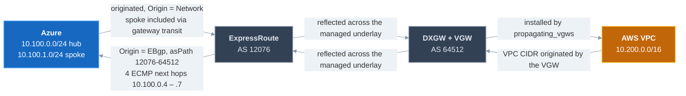

# Reading the control plane

> Building the lab? Start at the [README](../README.md). This document explains what
> the routing actually does, and is the first place to look when the path is up on one
> side but not the other.

## How the two sides exchange prefixes



Both directions have to be independently true. The most common half-broken state is the
top row working and the bottom row missing, or vice versa — ping then fails in one
direction only, which is easy to misread as a firewall problem.

## Why dump the learned routes at all

A successful `terraform apply` proves the *resources* exist. It proves nothing about
whether traffic can actually flow. Between "connection created" and "VMs can talk" sit
several silent failure modes:

- The ExpressRoute connection can be `Connected` while BGP has learned **nothing**.
- The spoke VNet can be peered without `use_remote_gateways`, so its prefix is never
  advertised to AWS — the Azure VM is then unreachable even though the hub works.
- The VGW can be attached but route propagation disabled, so AWS has no return path.
  **Connectivity fails asymmetrically**, which looks identical to a firewall problem from
  inside the VM.

The learned-route tables are the only place these show up *before* you start debugging
`ping`. They also tell you the path is genuinely private — no public hop, no NAT.

## Dump both sides

```powershell
# Azure: what the ExpressRoute gateway has learned
az network vnet-gateway list-learned-routes `
  --name ergw-mcilab --resource-group rg-mcilab-azure --output table

# AWS: what the VPC route table has been given by the VGW
aws ec2 describe-route-tables `
  --filters "Name=tag:Name,Values=rt-mcilab-vm" `
  --profile mcilab --output table
```

`scripts/02-verify.ps1` runs both and asserts on them.

## Azure side — what a healthy result looks like

```
network       nextHop    origin  asPath       sourcePeer
-------       -------    ------  ------       ----------
10.100.0.0/24            Network              10.100.0.13
10.100.1.0/24            Network              10.100.0.13
10.200.0.0/16 10.100.0.5 EBgp    12076-64512  10.100.0.5
10.200.0.0/16 10.100.0.6 EBgp    12076-64512  10.100.0.6
10.200.0.0/16 10.100.0.4 EBgp    12076-64512  10.100.0.4
10.200.0.0/16 10.100.0.7 EBgp    12076-64512  10.100.0.7
```

How to read it:

| Field | Meaning | Why it matters |
|---|---|---|
| `origin = Network` | Locally originated Azure prefixes | **Both `10.100.0.0/24` (hub) and `10.100.1.0/24` (spoke) must appear.** If the spoke is missing, `use_remote_gateways` didn't take and AWS will never learn the VM's subnet. This is the single most important line to check in a hub/spoke build. |
| `origin = EBgp` | Learned from an external peer | Confirms real BGP with AWS, not a static route. |
| `asPath = 12076-64512` | `12076` = Microsoft's ExpressRoute ASN, `64512` = the Direct Connect Gateway's Amazon-side ASN | End-to-end proof the prefix came **from the AWS DXGW through the Microsoft underlay**. A two-hop AS path with exactly these two numbers is the signature of a healthy multicloud interconnect. |
| 4 rows for `10.200.0.0/16` | Four next-hops: `10.100.0.4` – `.7` | The interconnect's **4-link ECMP** underlay, one BGP session per link. Seeing fewer than four means links are down — traffic still flows, but you've lost redundancy and throughput headroom. |
| `nextHop` inside `10.100.0.0/27` | The GatewaySubnet | The path stays on private addressing — no public hop. |

Note the ASNs are *not* something this repo configures. `64512` was read from the
existing DXGW during discovery; `12076` is Microsoft's. There is no BGP session to set up
on either side — see [The one thing to understand first](../README.md#the-one-thing-to-understand-first).

## AWS side — what a healthy result looks like

```
DestinationCidrBlock GatewayId             Origin                    State
-------------------- ---------             ------                    -----
10.200.0.0/16        local                 CreateRouteTable          active
0.0.0.0/0            igw-08b80331906ff1662 CreateRoute               active
10.100.0.0/24        vgw-0abc123def4567890 EnableVgwRoutePropagation active
10.100.1.0/24        vgw-0abc123def4567890 EnableVgwRoutePropagation active
```

- `Origin = EnableVgwRoutePropagation` is the proof the prefixes arrived **via BGP**, not
  as hand-written static routes. If you see `CreateRoute` for an Azure prefix, someone
  added a static route and the test is invalid.
- **Both Azure /24s must be present**, and `10.100.1.0/24` specifically — that's the
  subnet the Azure VM lives in. `02-verify.ps1` asserts on the spoke prefix for exactly
  this reason.
- ExpressRoute advertises the **individual VNet prefixes**, never the `10.100.0.0/16`
  supernet. The supernet exists only to keep the AWS security group rule simple.

## Also worth checking

```powershell
aws directconnect describe-direct-connect-gateway-associations `
  --direct-connect-gateway-id 11111111-2222-3333-4444-555555555555 `
  --profile mcilab --output table
```

State must be `associated` (not `associating`), and `allowedPrefixes` must list the AWS
VPC CIDR. A stuck `associating` is the usual reason Azure sees no AWS prefix.
